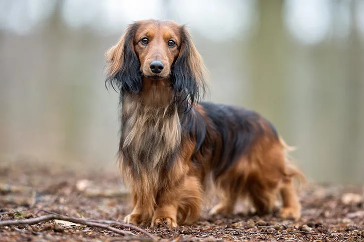

## Summary

 

<h3>{props.headline}</h3>

{props.description}

  <u>
    Level of Difficulty: {props.level}
     
    Role: {props.roles.join(', ')}
  </u>

 

## Project Name Trivia

Dachshunds come in two sizes and come in three coat types: smooth, wirehaired, or longhaired. With their unmistakable long-backed body, little legs, and big personality, they’re truly an icon of purebred dogdom. 

Dachshunds can be standard-sized (usually 16 to 32 pounds) or miniature (11 pounds or under), Dachshunds aren't built for distance running, leaping, or strenuous swimming, but otherwise these tireless hounds are game for anything. 

 

## Work Plan Overview

### Deliverable

Est sint eius omnis omnis. Eos cupiditate cupiditate exercitationem. Et nisi nostrum aliquid eius at aut illo.

 

### Current State

Quia magni porro facilis quo maxime. Possimus aut eveniet fugit enim. Pariatur voluptatem nulla totam at eligendi aliquid consequatur accusamus. Et et non assumenda voluptatem beatae dolorem similique adipisci velit. Occaecati doloribus id est quasi ea. Est voluptatem quos magnam totam voluptatum quisquam aut omnis dolores.

 

### Team Goal

Perferendis suscipit repellat. Sint iusto minima eum. Delectus accusamus enim aut quae quisquam omnis quo. Maxime nam impedit quis distinctio eum rerum accusamus sed reiciendis.

 

## Proposal

Et et magni qui molestiae distinctio. Sunt laborum molestiae odit cum vel delectus molestiae eos eum. Nobis quam ut inventore ducimus quidem culpa incidunt. Rerum modi in esse.

## Constraints and Challenges

Voluptatem illo odit nam qui. Unde quis labore magnam rerum. Fuga deleniti repudiandae debitis non tempora omnis. Velit omnis inventore aliquid voluptatem. Eveniet laboriosam delectus at.
