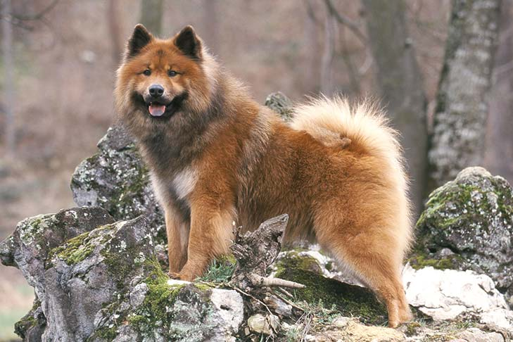

## Summary

 

<h3>{props.headline}</h3>

{props.description}

  <u>
    Level of Difficulty: {props.level}
     
    Role: {props.roles.join(', ')}
  </u>

 

## Project Name Trivia

The Eurasier is a medium-sized dog with a thick, medium-long coat that can come in a variety of colors. Confident, calm, and well-balanced, he is loyal to the entire family, but reserved towards strangers. He must live in close contact with his family, as he is not suited to be kept in kennels or tied up outside.


Eurasiers can have purple tongues, pink tongues or spotted tongues. They can also have dark face masks or light, so-called reverse masks. Eurasiers are calm, even-tempered, gentle, loving, intelligent and confident.  

 

## Workshop Overview

### Objective

By the end of this workshop, you’ll learn about Decentralized Web, its scope and principles (DWeb 101)

 

### Summary

What is the Decentralized Web / Web 3.0? And how can people get involved (a partnership with Accelerating Makers (TechSoup) x SheFi)
- SheFi is an online learning community for women and nonbinary people to learn about decentralized technologies. DeFi = decentralized finance. SheFi teaches courses on theory, concepts, and terminology. Plus they provide an in-depth understanding of top web3 use cases, and give participants the ability to actually start using these technologies.

- Accelerating Makers (by TechSoup) is an online learning community specifically focused on supporting nonprofit use cases of decentralized technologies and building DWeb for Social Good. We will explore real world examples of nonprofit DWeb use cases.

Updates coming soon!

