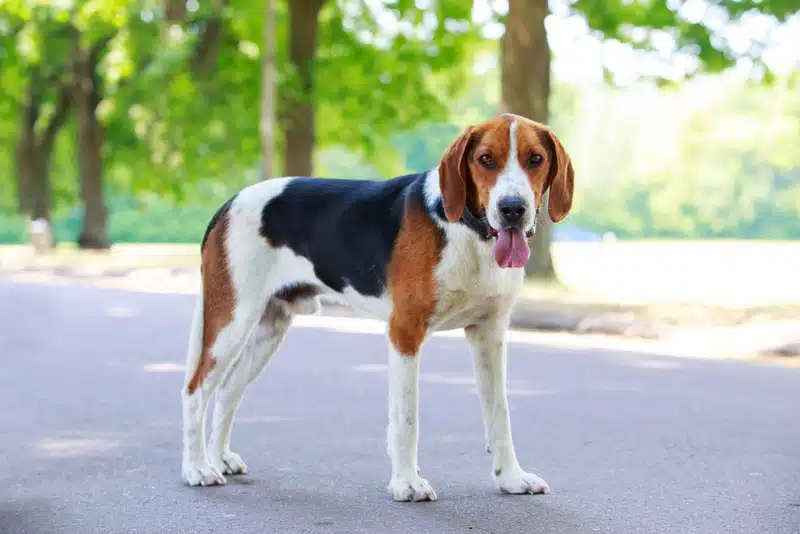

## Summary

 

<h3>{props.headline}</h3>

{props.description}

  <u>
    Level of Difficulty: {props.level}
     
    Role: {props.roles.join(', ')}
  </u>

 

## Project Name Trivia

American Foxhounds are good-natured, low-maintenance hounds who get on well with kids, dogs, even cats, but come with special considerations for prospective owners. They are closely associated with Revolutionary heroes and the rolling estates of old Virginia. American Foxhounds are sleek, rangy hunters known for their speed, endurance, and work ethic. You can tell the American Foxhound apart from their British cousin the English Foxhound by length of leg - 'the American's legs are longer and more finely boned'and by the American's slightly arched loin (back end).

Foxhounds come with special considerations. They need lots of exercise or they can get depressed and destructive. A Foxhound's single-minded prey drive must be managed.

 

## Project Overview

### Problem Statement
Hiring culture in tech is broken. Tech layoffs in the last few years impacted women the largest. A study conducted by Revelio Labs (using data from Layoffs.FYI) found that female staff accounted for 47% of dismissals between September and December of 2022.

Excerpt from 
- Latinos in Tech's Juarez said he is hopeful that massive layoffs will give rise to minority led-startups, his preferred solution to the stagnant DEI efforts. "We want to increase the amount of Latinos in the tech space but we're starting to see that some of these DEI efforts just don't work and we just need to essentially build our own path."
- Black and Asian talent has been less affected by the job cuts but the unexpected layoffs in tech may make it more difficult to attract diverse early-career talent to "the cool kid on the block" or well-known tech companies, said Morgan DeBaun, CEO of Blavity Inc, which hosts the largest annual Black tech conference, AfroTech.

 

### Nature of the Project

This is a UX research project that aims to:
- define and dissect the problem statement: how can jobseekers be supported in this climate? what are areas of the problem that can be explored and expanded on?
- stay in the problem space and leverage approriate UX research methods. By the end of the work, team shall make up to 3 recommendations on how the problem can be mitigated
- create guiding principles to inform future solutions

 

## Questions to answer

In the first phase of the project, we can explore:

- the ideal world of hiring women in tech, if the system is broken, what are the workarunds? what are the low effort vehicles that women can be supported in the job application process?

- Kapor Foundation believes in providing support for women in STEM. Create concepts and generate ideas based onthe Leaky tech pipeline framework - https://leakytechpipeline.com/barrier/tech-workforce-barriers/#social-capital

- Good solutions can be guided by principle. What does building a good hiring culture should be an end-to-end 
expressing kindness, intentional and inclusive themes and other positive design principles needed to influence the 

- Focus outside of a job board: How can we overturn the downward conversation? Pairing the job board with a human resume coach! It’s human centric vs tech solutioning. Avoid being another job board that favors the status quo corporate vibe.



