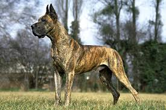

## Summary

 

<h3>{props.headline}</h3>

{props.description}

  <u>
    Level of Difficulty: {props.level}
     
    Role: {props.roles.join(', ')}
  </u>

 

## Project Name Trivia

No one is quite sure how or why Great Danes, a German breed, came to be associated with Denmark. (In Germany they're known as the Deutsche Dog, or 'German dog.') We do know that once upon a time, German nobles used Danes to hunt ferocious wild boars. Later, Danes became famous as protectors of their home and loved ones, a job they are still happy to perform.

 

## Work Plan Overview

We’re excited to announce an upcoming hackathon centered around Equitable Mapping, where participants will collaborate to create innovative prototypes for maps that enhance the accessibility and usability of [New York City’s Open Data.](https://opendata.cityofnewyork.us/) 
 

###The Goal
How might we enable data-driven storytelling to drive change in a community, through equitable mapping? As we work to foster inclusivity in data visualization, the goal of this project is to empower developers, designers, data scientists, and community members to propose topics and important issues that tells a story based on data and research.

 
###Prototype of the webpage
A [map visualizer](https://fastidious-manatee-98d51b.netlify.app/) Think Craigslist but with data indicators and data storytelling content, visualized through a map.

 
###What’s the goal of the hackathon?
The goal of this hackathon is to design a prototype for an interactive map that incorporates key indicators from NYC’s Open Data portal, allowing users to understand and interact with information in new, meaningful ways. 

###Why Participate?
Participating in this hackathon offers more than just a chance to innovate in the civic tech space—it’s an opportunity to make a real difference in how New Yorkers interact with their city. As a participant, you will:
* Gain hands-on experience with NYC Open Data and the tools necessary to create impactful data-driven solutions.
* Have the opportunity to showcase your project and have it used by the city’s residents and organizations to solve real-world challenges.
* Contribute to making NYC’s data more accessible and usable for everyone.

 
###What’s expected?
Your project should meet the following criteria:
1. Data Understanding & Problem Solving:
    * Does the prototype improve a user’s ability to understand a specific NYC Open Data dataset? Think about how your map design could clarify complex datasets or make them more accessible to a broader audience.
    * Does your project help New Yorkers answer pressing questions or solve community-based problems using the data? This could include helping residents make decisions related to health, safety, housing, education, and more.
2. Instructional Overview:
    * It’s not just about the map; it’s about sharing knowledge. Provide a clear instructional overview of your project, including a breakdown of the datasets used, the analytics process, and design decisions. Share your code and discuss the challenges and insights you encountered throughout the process. This transparency is key to fostering a collaborative, learning-focused environment.
3. Stretch goal: Wireframing the map’s design
    * The map and data presentation should feature compelling, intuitive, and easy-to-understand visuals. Consider a variety of design elements like color schemes, navigation, and layout that would best serve the target users.
    * Keep accessibility in mind—ensure the map is designed in a way that can be easily understood by all users, including those with disabilities.

 

###Who should participate?
We welcome participants from all backgrounds—whether you’re a developer, designer, data scientist, community organizer, or just someone passionate about making data more accessible. All skill levels are encouraged to join, and we’re particularly interested in solutions that take an equitable approach to presenting and engaging with data.

 

###Example Themes and Focus Areas
Participants can choose from a variety of NYC Open Data themes to base their projects on. Some potential focus areas could include:
* Affordable Housing & Gentrification: Create a map that helps residents understand neighborhood changes over time, access to affordable housing, and potential areas at risk of displacement.
* Transportation Accessibility: Design a tool that helps individuals with disabilities or limited mobility navigate NYC’s public transportation system more efficiently.
* Environmental Justice: Build a map that highlights air quality, green spaces, and environmental hazards to help communities track environmental health risks.
* Public Health & Safety: Create visualizations that track health disparities, vaccination rates, or crime data across different neighborhoods to give residents insights into local health and safety issues.

 

###How to Get Involved
To participate, simply sign up through the event website and start brainstorming ideas for your project. Whether you're working individually or as part of a team, we encourage you to dive into [NYC Open Data’s resources] (https://opendata.cityofnewyork.us/projects/) and explore the datasets available for mapping.
