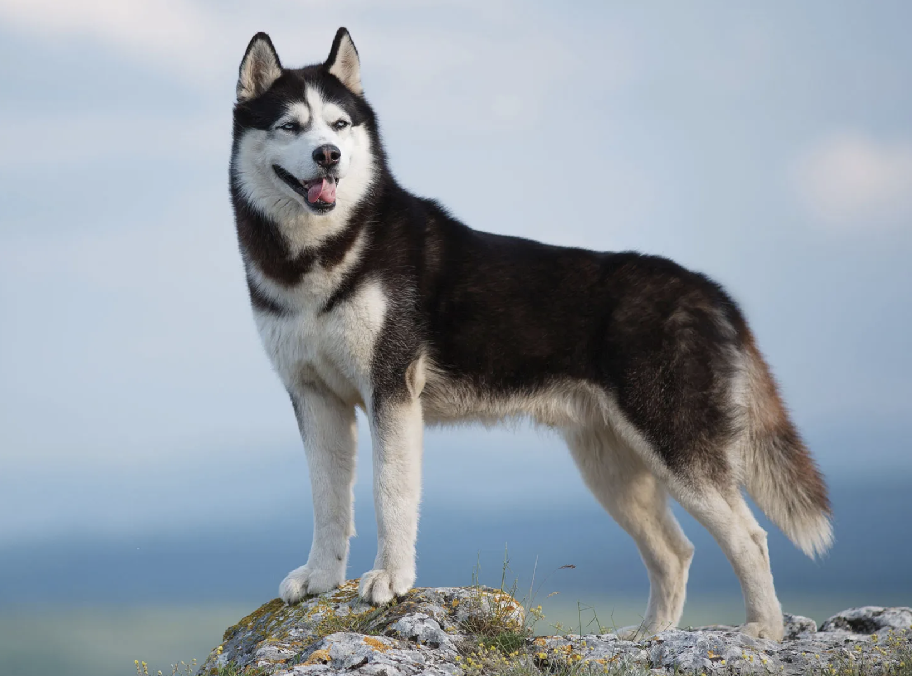

## Summary

 

<h3>{props.headline}</h3>

{props.description}

  <u>
    Level of Difficulty: {props.level}
     
    Role: {props.roles.join(', ')}
  </u>

 

## Project Name Trivia

Siberian Husky, a thickly coated, compact sled dog of medium size and great endurance, was developed to work in packs, pulling light loads at moderate speeds over vast frozen expanses. Sibes are friendly, fastidious, and dignified. The graceful, medium-sized Siberian Husky's almond-shaped eyes can be either brown or blue and sometimes one of each and convey a keen but amiable and even mischievous expression

 

## Work Plan Overview

### Problem Statement

The challenge this project addresses is that families of children with autism in the U.S. face significant barriers to accessing free educational resources. This project bridges these gaps by developing an AI agent, open-sourcing solutions, and collaborating with institutions to connect academic research with real-world applications.
The challenge is significant because over 2 million children in the U.S. have autism (CDC), with thousands of families unable to access free resources due to procedural complexity, lack of centralized information, and language barriers

 

### Project Proposal

1. Project Rationale
The generative AI-powered solution we are proposing is BRIDGE LAB, an initiative that helps academia explore generative AI’s potential for social impact. It begins with an AI agent that connects children with autism in the U.S. to community partners, helping families access free, individualized educational support.
2. What is the deliverable?
The solution will effectively address the problem described above by developing an AI agent that uses generative AI to simplify resource navigation, provide multilingual support, and offer personalized pathways. This approach will be guided by rigorous prototyping, testing, and collaboration with parents, community partners, and institutions.
3. Outcome and Impact
The end beneficiaries we hope to support are children with autism and their families, starting in Southern California and expanding nationwide. With 100,000 in Southern California, 240,000 in California, and 2 million across the U.S., we also assist educators, school districts, and the special education community.

 

### Scope of the Project

Phase 1 - Landing Page Creation
* Content Strategy
* Creating a Wiki page
* Creation of Survey questions
* Set up Analytics or CRM tool to add to the landing page.

 

Phase 2 - this project focuses largely on content modeling work
* Map out responses from analytics or feedback gathering app
* Data modeling the AI response
* Using Chat GPT for scalable process of documentation

 

### Contributors Needed:
* content designers, product designers, researchers
* GenAI interest
* passion for community
